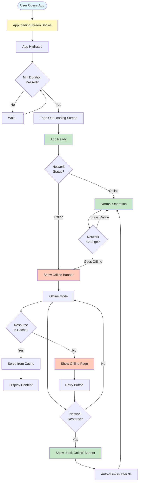
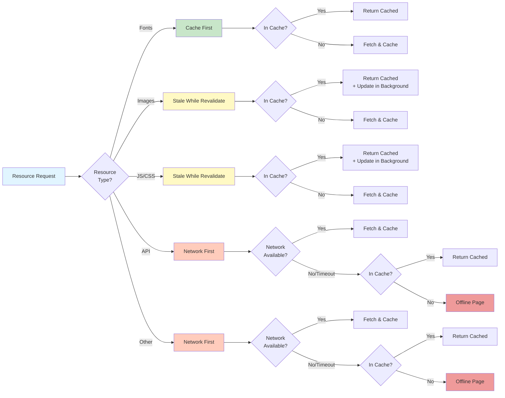

# Progressive Web App (PWA) Documentation

Welcome to the PWA documentation for **Douro Bats Padel**. This directory contains comprehensive documentation about the Progressive Web App implementation, including setup, features, and usage guides.

## 📚 Documentation Structure

### 🚀 [Quick Start Guide](./QUICK_START.md)

**Start here if you want to test the PWA features immediately.**

- Quick testing instructions for development and production
- Feature overview
- Common customizations
- Debugging tips
- Troubleshooting checklist

**Best for:** Developers who want to quickly test and verify PWA functionality.

---

### 📋 [Implementation Summary](./IMPLEMENTATION_SUMMARY.md)

**High-level overview of what was implemented.**

- Complete feature list
- Files created and modified
- Testing instructions
- Customization options
- Internationalization details

**Best for:** Understanding what's been implemented and how to customize it.

---

### 🔧 [PWA Setup Guide](./PWA_SETUP.md)

**Complete PWA configuration and setup details.**

- PWA plugin configuration
- Web app manifest
- Meta tags and metadata
- Icon generation
- Installation testing
- Deployment considerations

**Best for:** Understanding the core PWA setup and configuration.

---

### 💻 [Technical Details](./LOADING_AND_OFFLINE.md)

**In-depth technical documentation.**

- Component architecture
- Service worker caching strategies
- API reference
- Configuration options
- Advanced customization

**Best for:** Developers who need detailed technical information.

---

## 🎯 Key Features

### ✨ Loading Screen

- Branded splash screen with smooth animations
- Configurable minimum display duration (800ms)
- Prevents jarring flashes on fast connections

### 🌐 Offline Detection

- Real-time network status monitoring
- Visual indicators when offline/online
- Auto-dismissing notifications
- Fully internationalized (EN/PT)

### 💾 Service Worker Caching

- Smart caching strategies for different resource types
- Offline-first approach for static assets
- Network-first for API calls with cache fallback
- 10-second timeout before falling back to cache

### 📱 PWA Features

- Installable on all platforms (iOS, Android, Desktop)
- Works offline after first visit
- Beautiful offline fallback page
- Auto-reconnect when network restored

### 🔄 Pull-to-Refresh

- Native mobile gesture - swipe down to refresh
- Visual feedback with animated indicator
- Smart threshold detection
- Smooth animations with progress bar
- Works on all pages automatically

---

## 🎨 Visual Flow Diagrams

### Application Loading & Offline Flow



### Service Worker Caching Strategy



---

## 🚦 Quick Start

### Development Mode

```bash
pnpm dev
```

- ✅ Loading screen works
- ✅ Offline indicator works
- ❌ Service worker disabled

### Production Mode

```bash
pnpm build && pnpm start
```

- ✅ All features enabled
- ✅ Service worker active
- ✅ Full offline support

---

## 📂 File Structure

```
apps/web/
├── docs/pwd/
│   ├── README.md                    # This file
│   ├── QUICK_START.md              # Quick testing guide
│   ├── IMPLEMENTATION_SUMMARY.md   # What was implemented
│   ├── PWA_SETUP.md                # Core PWA setup
│   └── LOADING_AND_OFFLINE.md      # Technical details
├── src/
│   ├── components/shared/
│   │   ├── app-loading-screen.tsx  # Loading screen component
│   │   └── offline-indicator.tsx   # Offline banner component
│   ├── hooks/
│   │   └── use-online-status.ts    # Network status hook
│   └── app/[lang]/
│       └── layout.tsx               # Main layout with PWA components
├── public/
│   ├── manifest.json                # PWA manifest
│   ├── offline.html                 # Offline fallback page
│   └── icons/                       # PWA icons
└── next.config.js                   # PWA configuration
```

---

## 🔗 Quick Links

- **Test Offline:** DevTools → Network → Offline
- **View Service Worker:** DevTools → Application → Service Workers
- **View Cache:** DevTools → Application → Cache Storage
- **Test Installation:** Look for install icon in browser address bar

---

## 📞 Need Help?

- Check the [Troubleshooting section](./IMPLEMENTATION_SUMMARY.md#-troubleshooting) in the Implementation Summary
- Review the [Quick Start Guide](./QUICK_START.md) for common issues
- See [Technical Details](./LOADING_AND_OFFLINE.md) for advanced configuration

---

**Last Updated:** March 2026
