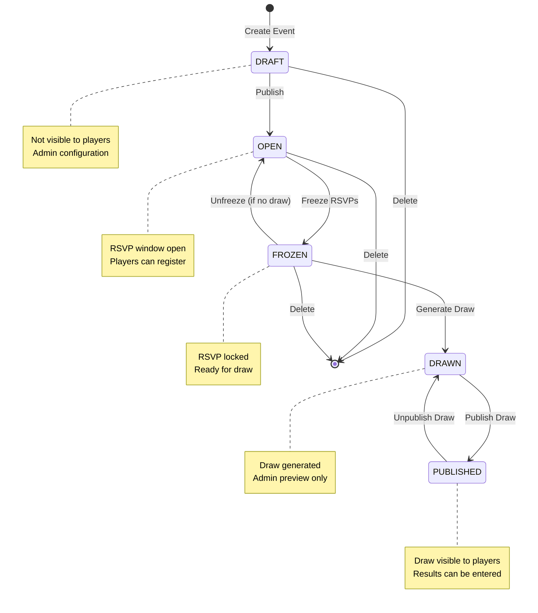

# Event States Documentation

## Overview

The system uses a **state machine** with 5 distinct states that an event progresses through during its lifecycle:

```
DRAFT → OPEN → FROZEN → DRAWN → PUBLISHED
```

## State Definitions

### 1. 📝 DRAFT

- **Initial state** when an event is first created
- Event is **not visible** to regular players (only admins/editors can see it)
- Admin can configure all event details (date, venue, courts, capacity, tier rules)
- **Actions available:**
  - ✏️ Edit event details
  - 🗑️ Delete event
  - 📢 **Publish** → moves to `OPEN`

### 2. 🟢 OPEN

- Event is **published and visible** to all players
- **RSVP window is open** - players can register (IN) or cancel (OUT)
- Players are assigned to CONFIRMED or WAITLISTED status based on capacity
- **Actions available:**
  - ✏️ Edit event details
  - 🗑️ Delete event
  - 🔒 **Freeze RSVPs** → moves to `FROZEN`

### 3. 🔒 FROZEN

- **RSVP window is closed** - no new registrations allowed
- Player list is locked and ready for draw generation
- Admin can still manually adjust RSVPs if needed
- **Actions available:**
  - ✏️ Edit event details
  - 🗑️ Delete event
  - 🔓 **Unfreeze** → moves back to `OPEN` (only if no draw exists)
  - 🎲 **Generate Draw** → moves to `DRAWN`

### 4. 🎲 DRAWN

- **Draw has been generated** - match assignments are created
- Players are assigned to courts, rounds, and teams
- Players are split into MASTERS and EXPLORERS tiers
- Draw is **not yet visible** to players (admin preview only)
- **Actions available:**
  - ✏️ Edit draw assignments (swap players, change teams)
  - 🗑️ Delete draw (returns to `FROZEN`)
  - 📢 **Publish Draw** → moves to `PUBLISHED`

### 5. 📢 PUBLISHED

- **Draw is visible** to all players
- Players can see their match assignments, courts, and schedules
- After event ends, admin can enter match results
- **Actions available:**
  - 📊 **Enter Results** (after event ends)
  - 🔓 **Unpublish Draw** → moves back to `DRAWN`

## State Transitions

### Forward Transitions

| From   | To        | Action        | API Endpoint                          |
| ------ | --------- | ------------- | ------------------------------------- |
| DRAFT  | OPEN      | Publish Event | `POST /events/:id/publish`            |
| OPEN   | FROZEN    | Freeze RSVPs  | `POST /events/:id/freeze`             |
| FROZEN | DRAWN     | Generate Draw | `POST /draws/events/:eventId`         |
| DRAWN  | PUBLISHED | Publish Draw  | `POST /draws/events/:eventId/publish` |

### Backward Transitions

| From      | To    | Action         | API Endpoint                            | Conditions     |
| --------- | ----- | -------------- | --------------------------------------- | -------------- |
| FROZEN    | OPEN  | Unfreeze Event | `POST /events/:id/unfreeze`             | No draw exists |
| PUBLISHED | DRAWN | Unpublish Draw | `POST /draws/events/:eventId/unpublish` | -              |

## Visual State Machine



## Edit Restrictions

Based on event state and whether the event has passed:

| State         | Event Passed? | Can Edit? | Reason                       |
| ------------- | ------------- | --------- | ---------------------------- |
| **DRAFT**     | ❌ No         | ✅ Yes    | Event hasn't passed          |
| **DRAFT**     | ✅ Yes        | ✅ Yes    | Never drawn/published        |
| **OPEN**      | ❌ No         | ✅ Yes    | Event hasn't passed          |
| **OPEN**      | ✅ Yes        | ✅ Yes    | Never drawn/published        |
| **FROZEN**    | ❌ No         | ✅ Yes    | Event hasn't passed          |
| **FROZEN**    | ✅ Yes        | ✅ Yes    | Never drawn/published        |
| **DRAWN**     | ❌ No         | ✅ Yes    | Event hasn't passed          |
| **DRAWN**     | ✅ Yes        | ❌ **No** | Draw exists and event passed |
| **PUBLISHED** | ❌ No         | ✅ Yes    | Event hasn't passed          |
| **PUBLISHED** | ✅ Yes        | ❌ **No** | Published and event passed   |

### Edit Logic Implementation

**Backend** (`apps/api/src/events/events.service.ts`):

```typescript
// Allow editing if:
// 1. Event hasn't passed yet, OR
// 2. Event was never published (state is DRAFT, OPEN, or FROZEN), OR
// 3. Event was never drawn (state is DRAFT, OPEN, or FROZEN)
const canEdit =
  !hasEventPassed ||
  event.state === EventState.DRAFT ||
  event.state === EventState.OPEN ||
  event.state === EventState.FROZEN;

if (!canEdit) {
  throw new BadRequestException('Cannot update a past event that has been drawn or published');
}

// Check if trying to edit timing fields when players are already registered
const isEditingTiming =
  dto.date !== undefined || dto.startsAt !== undefined || dto.endsAt !== undefined;
const hasConfirmedPlayers = event.rsvps.length > 0;

if (isEditingTiming && hasConfirmedPlayers) {
  throw new BadRequestException(
    'Cannot edit event timing (date, start time, or end time) when players are already registered'
  );
}
```

**Frontend** (`apps/web/src/app/[lang]/admin/events/[id]/edit/page.tsx`):

```typescript
const eventEndTime = event?.endsAt ? new Date(event.endsAt) : null;
const hasEventPassed = eventEndTime ? eventEndTime < new Date() : false;
const canEdit =
  !hasEventPassed ||
  event?.state === 'DRAFT' ||
  event?.state === 'OPEN' ||
  event?.state === 'FROZEN';
const cannotEdit = !canEdit;
```

## Key Business Rules

1. **Events start as DRAFT** and are invisible to players until published
2. **RSVP management** happens in OPEN and FROZEN states
3. **Draw generation** requires FROZEN state (locked player list)
4. **Players see the draw** only in PUBLISHED state
5. **Past events** that were drawn/published **cannot be edited** (data integrity)
6. **Past events** that were never drawn/published **can still be edited** (incomplete events)
7. **Deleting a draw** returns the event to FROZEN state
8. **Unfreezing** is only allowed if no draw exists
9. **Event timing cannot be changed** (date, startsAt, endsAt) once players have registered with CONFIRMED status

## Field-Specific Edit Restrictions

### Timing Fields (date, startsAt, endsAt)

**Special Rule**: Event timing cannot be edited once players have registered with CONFIRMED status.

**Rationale**: Players commit to specific dates and times when they register. Changing the event timing after players have confirmed would be unfair and could cause scheduling conflicts.

**What can still be edited**:

- ✅ Event title
- ✅ Venue
- ✅ Courts
- ✅ Capacity (with caution)
- ✅ RSVP windows
- ✅ Tier rules

**What cannot be edited** (if confirmed players exist):

- ❌ Event date
- ❌ Start time (startsAt)
- ❌ End time (endsAt)

**Workaround**: If timing must be changed after players have registered:

1. Admin must manually cancel all confirmed RSVPs
2. Then the timing fields can be edited
3. Players can re-register with the new timing

## State-Specific Behaviors

### RSVP Handling

- **DRAFT**: RSVPs not allowed (event not visible)
- **OPEN**: RSVPs allowed within RSVP window (`rsvpOpensAt` to `rsvpClosesAt`)
- **FROZEN**: RSVPs closed, but admin can manually adjust
- **DRAWN/PUBLISHED**: RSVPs locked (draw already generated)

### Player Visibility

- **DRAFT**: Only admins/editors can see the event
- **OPEN**: All players can see and RSVP to the event
- **FROZEN**: All players can see the event (RSVP closed)
- **DRAWN**: All players can see the event, but not the draw
- **PUBLISHED**: All players can see the event and the draw

### Deletion Rules

- **DRAFT/OPEN/FROZEN**: Event can be deleted
- **DRAWN/PUBLISHED**: Event cannot be deleted (historical data)
  - Must unpublish draw first, then delete draw, then delete event

## Implementation Files

### Backend

- **State enum**: `packages/types/src/common.ts`
- **Event service**: `apps/api/src/events/events.service.ts`
- **Event controller**: `apps/api/src/events/events.controller.ts`
- **Draw service**: `apps/api/src/draw/draw.service.ts`
- **RSVP service**: `apps/api/src/events/rsvp.service.ts`

### Frontend

- **Event layout**: `apps/web/src/app/[lang]/admin/events/[id]/layout.tsx`
- **Event details**: `apps/web/src/components/admin/event-details.tsx`
- **Edit page**: `apps/web/src/app/[lang]/admin/events/[id]/edit/page.tsx`
- **Generate draw**: `apps/web/src/components/admin/generate-draw.tsx`

## Database Schema

```prisma
enum EventState {
  DRAFT
  OPEN
  FROZEN
  DRAWN
  PUBLISHED
}

model Event {
  id            String      @id @default(cuid())
  state         EventState  @default(DRAFT)
  // ... other fields
}
```

## API Endpoints Summary

| Endpoint                           | Method | Action         | Required State           |
| ---------------------------------- | ------ | -------------- | ------------------------ |
| `/events`                          | POST   | Create event   | - → DRAFT                |
| `/events/:id`                      | PATCH  | Update event   | See edit restrictions    |
| `/events/:id/publish`              | POST   | Publish event  | DRAFT → OPEN             |
| `/events/:id/freeze`               | POST   | Freeze RSVPs   | OPEN → FROZEN            |
| `/events/:id/unfreeze`             | POST   | Unfreeze event | FROZEN → OPEN            |
| `/draws/events/:eventId`           | POST   | Generate draw  | FROZEN → DRAWN           |
| `/draws/events/:eventId/publish`   | POST   | Publish draw   | DRAWN → PUBLISHED        |
| `/draws/events/:eventId/unpublish` | POST   | Unpublish draw | PUBLISHED → DRAWN        |
| `/draws/events/:eventId`           | DELETE | Delete draw    | DRAWN/PUBLISHED → FROZEN |
| `/events/:id`                      | DELETE | Delete event   | DRAFT/OPEN/FROZEN only   |
